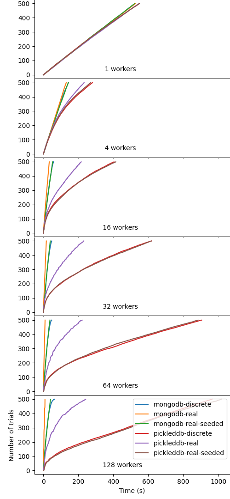

Stress Tests
============

There is many potential scenarios leading to race conditions in Oríon due to the
use of multiple concurrent workers attempting to generate or reserve trials in parallel.

While these race conditions are tested in unit-tests with hand-crafted scenarios it is impossible
to ensure tests coverage for all possible scenarios.
The stress tests aims at pushing the Oríon to it's limit, increasing the chances of
uncovering hidden bugs from the unit-tests. Being resource intensive, the stress-tests
are not part of the continuous integration pipeline that is executed for every
contribution to code. The stress-test should be run before every release, with the
resulting plots shared on the pull-request of the release candidate. Core members
reviewing a pull-request may run the stress-test if there is reasonable doubts on the effect of the
contribution on the efficiency of Oríon.

Execution
---------

The stress tests are include in ``tox``, you can therefore run all stress tests
with the simple command ``$ tox -e stress``. If you intend to run the tests directly without
using ``tox``, make sure to install the additional dependencies of the stress tests
with ``$ pip install -r tests/stress/requirements.txt``.

The stress tests include sleeps to simulate workloads in the different workers, nevertheless
it is better advised to execute them on a machine with sufficient cores to run many workers in
parallel. The results provided below were executed on a machine with 16 cores for instance.

Results
-------

The tests verify the coherence of the results, validating that no race-conditions were
improperly handled leading to corrupted entries. The absence of errors does not imply the code base
is free of bugs, but stress tests are very likely to uncover them.

The tests verifies that the number of trials for the completed experiments is exactly equal to
``max_trials`` and verifies that all points are different.
Additionally, each worker reports the number of trials that was executed. The total
of the number of executed trials is matched against ``max_trials``.

Finally, the benchmarking of the different scenarios, for different number of workers,
different database backend and different search space (discrete or real) are plotted
in a file ``test.png`` as reported below. Numerical results are also saved in a file
``test.json``.

